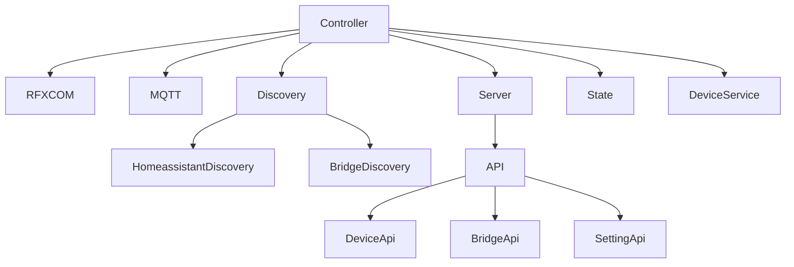

# RFXCOM2MQTT

[](http://www.rfxcom.com)

RFXCOM to MQTT bridge for RFXtrx433 devices

## Overview

rfxcom2mqtt is a bridge between RFXCOM (RFXtrx433) devices and MQTT. It publishes RFXCOM events to MQTT topics and also supports integration with Home Assistant via MQTT discovery.

All received RFXCOM events are published to the MQTT topic rfxcom2mqtt/devices/\<id\>. 
It's up to the MQTT receiver to filter these messages or have a registration/learning/pairing mechanism.

## Project Architecture

The project is structured into several interacting modules:



### Main Components

1. **Controller**: Main class that coordinates all components
2. **RFXCOM**: Manages communication with RFXtrx433 devices
3. **MQTT**: Manages communication with the MQTT broker
4. **Discovery**: Manages device discovery and Home Assistant integration
5. **Server**: Manages the web interface
6. **State**: Manages device and entity states
7. **DeviceService**: Manages RFXCOM devices

## Key Features

### 1. RFXCOM Device Communication

The RFXCOM module (src/adapters/rfxcom) is responsible for communication with RFXtrx433 devices. It:

- Initializes the connection with the RFXCOM device via the configured USB port
- Manages RFXCOM protocols (activation, event listening)
- Processes commands received via MQTT and sends them to RFXCOM devices
- Handles status and disconnection events
- Provides methods for sending specific commands (such as RFY for roller shutters)

### 2. MQTT Communication

The MQTT module (src/adapters/mqtt) manages communication with the MQTT broker. It:

- Establishes a connection with the configured MQTT broker
- Manages MQTT topics (base, devices, will, info)
- Publishes messages to MQTT topics
- Subscribes to MQTT topics and forwards received messages to listeners
- Manages connection state (online/offline)

### 3. Device Discovery

The Discovery module (src/adapters/discovery) manages device discovery and Home Assistant integration. It coordinates two types of discovery:

- **HomeassistantDiscovery**: for discovering RFXCOM devices in Home Assistant
- **BridgeDiscovery**: for discovering the RFXCOM bridge in Home Assistant

### 4. Web Interface and API

The Server module (src/application) manages the project's web interface. It:

- Configures an Express server for the web interface
- Handles authentication if a token is configured
- Configures HTTPS if SSL certificates are provided
- Serves frontend content (user interface)
- Configures API routes
- Initializes the WebSocket service for real-time communications

## Usage


### [Home Assistant Integration](./docs/usage/integrations/home_assistant.md)

The easiest way to integrate Rfxcom2MQTT with Home Assistant is to use [MQTT discovery](https://www.home-assistant.io/integrations/mqtt#mqtt-discovery).
This allows Rfxcom2MQTT to automatically add devices to Home Assistant.

### Configuration

See the **config.yml** example file.

### Available Commands List

[DeviceCommands](https://github.com/rfxcom/node-rfxcom/blob/master/DeviceCommands.md)

### [MQTT Topics and Messages](./docs/usage/mqtt_topics_and_messages.md)

### Somfy RFY Integration

#### Home Assistant Configuration

Add these lines to your /hass-config/configuration.yaml file.

``` YML
mqtt:
  cover:
    - name: "BSO Cover"
      command_topic: "rfxcom2mqtt/command/rfy/0x0B0003,0x020405,0x000006,0x000007"
      state_topic: "rfxcom2mqtt/command/rfy/0x0B0003,0x020405,0x000006,0x000007"
      availability:
        - topic: "rfxcom2mqtt/bridge/status"
      qos: 0
      retain: false
      payload_open: '{ "command": "up" }'
      payload_close: '{ "command": "down" }'
      payload_stop: '{ "command": "stop" }'
      state_open: "open"
      state_opening: "opening"
      state_closed: "closed"
      state_closing: "closing"
      payload_available: "online"
      payload_not_available: "offline"
      optimistic: false
      value_template: "{{ value.x }}"
      
    - name: "Game Room Cover"
      command_topic: "rfxcom2mqtt/command/rfy/0x000002"
      state_topic: "rfxcom2mqtt/command/rfy/0x000002"
      availability:
        - topic: "rfxcom2mqtt/bridge/status"
      qos: 0
      retain: false
      payload_open: '{ "command": "up" }'
      payload_close: '{ "command": "down" }'
      payload_stop: '{ "command": "stop" }'
      state_open: "open"
      state_opening: "opening"
      state_closed: "closed"
      state_closing: "closing"
      payload_available: "online"
      payload_not_available: "offline"
      optimistic: false
      value_template: "{{ value.x }}"
```

#### MQTT Trigger [[MQTT explorer]](https://mqtt-explorer.com/)

##### MQTT Topics

* Topic by name: rfxcom2mqtt/command/rfy/Mezanine3
* Topic by id: rfxcom2mqtt/command/rfy/0x000003
* Topic by id list: rfxcom2mqtt/command/rfy/0x000001,0x000002,0x000003

##### MQTT Payload

``` MQTT
{
  "command": "up"
}
```

##### MQTT Commands

* up
* down
* stop
* program

#### rfxcom2mqtt Configuration (optional)

``` YML
devices:
  - id: '0x000003'
    name: 'Mezzanine3'
    friendlyName: 'Mezzanine 3'
    type: 'rfy' 
    subtype: 'RFY'
    blindsMode: 'EU'
```

### Healthcheck

If healthcheck is enabled in the configuration, the rfxcom status will be checked every minute.
In case of error, the node process will terminate.
If installed in docker, the container will try to restart and reconnect to the RFXCOM device.

## Data Models

The models module (src/core/models) defines the data models used in the project. Here are the main classes:

1. **Action**: represents an action to execute on a device or the bridge
2. **DeviceEntity**: base class for device entities
3. **DeviceState**: represents a device's state
4. **DeviceStateStore**: manages a device's state and provides methods to manipulate it
5. **DeviceSensor, DeviceBinarySensor, DeviceSwitch, DeviceCover, DeviceSelect**: represent different types of device entities
6. **BridgeInfo**: represents information about the RFXCOM bridge

## Configuration

The project configuration is defined in a YAML file (config.yml). Here are the main sections:

1. **loglevel**: logging level (info, debug, warn, error)
2. **healthcheck**: configuration for checking RFXCOM status
3. **cacheState**: configuration for saving device states
4. **homeassistant**: configuration for Home Assistant integration
5. **mqtt**: configuration for MQTT connection
6. **rfxcom**: configuration for RFXCOM connection
7. **devices**: list of devices with their IDs, names, and types
8. **frontend**: configuration for the web interface

## Dependencies

The [RFXCOM](https://github.com/rfxcom/node-rfxcom) Node library for communication with the [RFXCOM](http://www.rfxcom.com) RFXtrx433 433.92MHz Transceiver.

The [MQTT.js](https://github.com/mqttjs/MQTT.js) library for sending and receiving MQTT messages.

Other main dependencies:
- **express**: web framework for the user interface
- **socket.io**: library for WebSocket communications
- **winston**: library for logging
- **js-yaml**: library for YAML file management

## Development

``` Node
nvm install 18.18
nvm use 18.18
npm install

npm install -g typescript
npm install -g ts-node

ts-node .\src\index.ts
```

### Building a Docker Image

Building a local image

```
docker-compose build
```

Building a multi-architecture image

```
docker buildx build \ 
--platform linux/amd64,linux/arm/v7 \
--push \
-t rfxcom2mqtt/rfxcom2mqtt .
```

## Contributing

Contributions are welcome! Please feel free to submit a Pull Request.

## License

This project is licensed under the Apache-2.0 License - see the LICENSE file for details.
